教程来自

- [Angular](https://angular.cn/)
- [Angular 全套实战教程，零基础入门前端框架\_哔哩哔哩\_bilibili](https://www.bilibili.com/video/BV1R54y1J75g?p=27)

还差

- 表单

- 生命周期

- rxjs


- ng 识别符

- 无限滚动

- ngModel

- \* 和 []

- 插槽

- 结构型指令

- ref

- onpush

<!--more-->

## 设计原则

基本

1. YAGNI You Arn't Gonna Need It.

2. dry Don't Repeat Yourself.

3. 对扩展开放，对修改封闭

4. 高内聚低耦合

5. 最少知识原则

框架

1. **组件是与用户交互的对象，所有操作都应该与用户操作有关，与用户操作无关的应该放在服务里，剥离在外为组件服务**

## 基础概念

只能通过脚手架构建

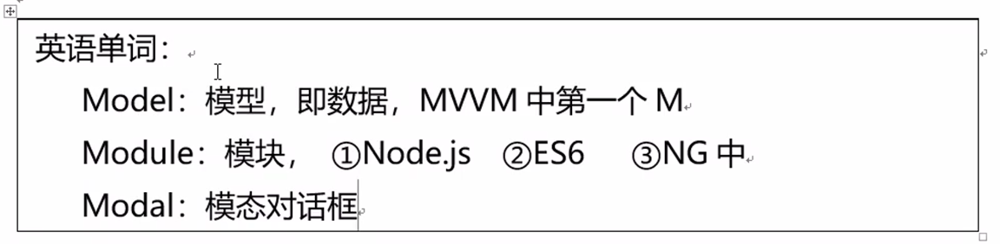

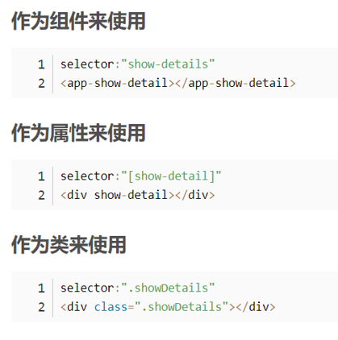


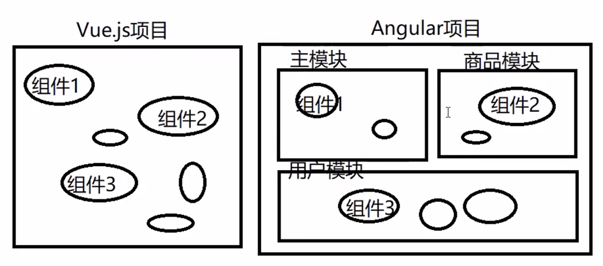

模块是抽象透明的容器

主模块（APP）有且只有一个

项目结构：[Angular - 风格指南](https://angular.cn/guide/styleguide#overall-structural-guidelines) [如何更好地组织angular项目 - 掘金](https://juejin.cn/post/6844903829436104717) [如何更好地组织Angular项目 | tc9011's](https://tc9011.com/2019/04/24/%E5%A6%82%E4%BD%95%E6%9B%B4%E5%A5%BD%E5%9C%B0%E7%BB%84%E7%BB%87angular%E9%A1%B9%E7%9B%AE/)

## 备忘

- 路径既可以以根目录为根，也可以以当前位置为根或以模块为根

- 元素中的#表示编号，只有 angular 能使用，不是给 html 用 表示 template reference

- ng-template 不会渲染到 dom 树 是透明的

- ng-template 与 ng-container 的区别：template 里面得有结构化指令或者 tenplate 编号，没有不渲染，ng-cotainer 就是透明的

## 组件 component

### 备忘

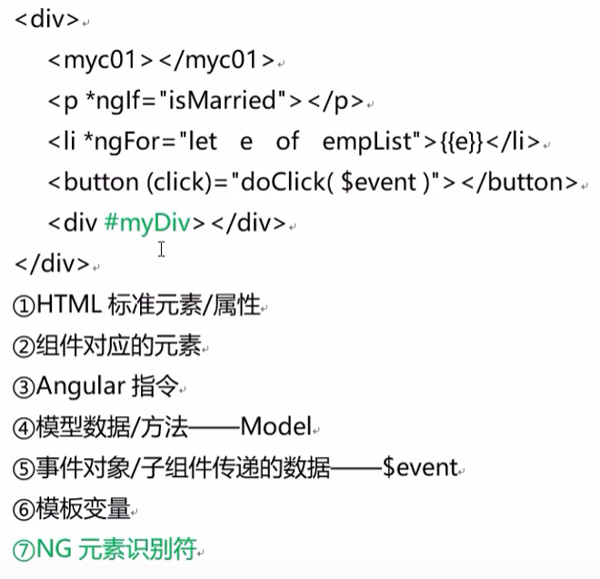

### 创建

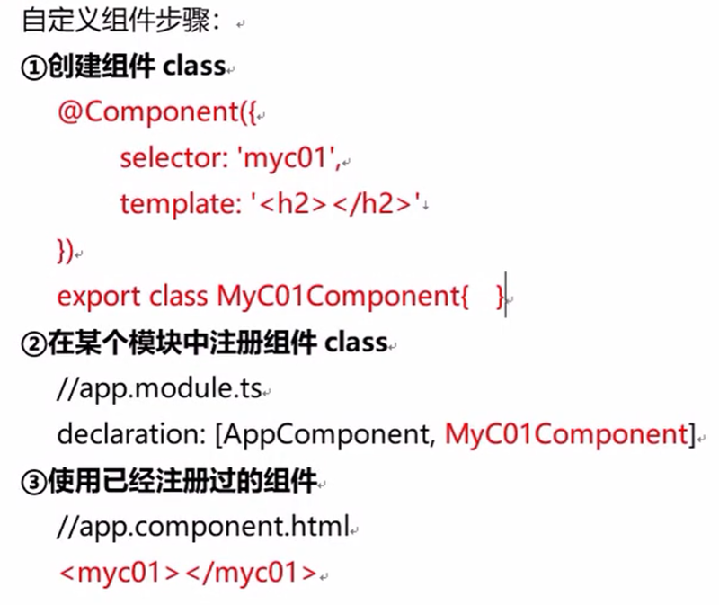

```shell
ng g component component-name
```

横线分割单词

在哪个 module 的文件夹下就创建在哪个 module 里，不在任何 module 下就在默认

### 基本状态

多文件组件：使用 templateUrl 和 styleUrls

```typescript
@Component({
  selector: "app-my-com",
  templateUrl: "./my-com.component.html",
  styleUrls: ["./my-com.component.scss"],
})
export class MyComComponent implements OnInit {
  constructor() {}
  ngOnInit(): void {}
}
```

### 绑定

#### 归纳

Model->View 改变属性 []

View->Model 触发事件 ()

双向绑定 [()]

#### 绑定 HTML

```html
{{NG表达式}}
```

NG 表达式能各种运算

不能 new 对象

不能用 JSON 对象，**可以用`jsonPipe`**

就是不能有副作用

#### 绑定数据

```html
<p attribute="{{value}}">text</p>
<p [attribute]="value">text</p>
```

里面也可以是 NG 表达式

#### 绑定事件

```html
<p (event name)="func()">text</p>
<p (event name)="func($event)">text</p>
```

函数一定要加括号

#### 绑定样式 style

```html
<nav [style.background-color]="expression"></nav>
<nav [style.backgroundColor]="expression"></nav>
```

可以用小驼峰，也可以连字符

ngStyle  不再提供显著价值，将来可能会被删除。(等于多重样式绑定的最后一种)

**当把  `[style]`  绑定到对象表达式时，该对象的引用必须改变，这样 Angular 才能更新这个类列表。在不改变对象引用的情况下更新其属性值是不会生效的。**

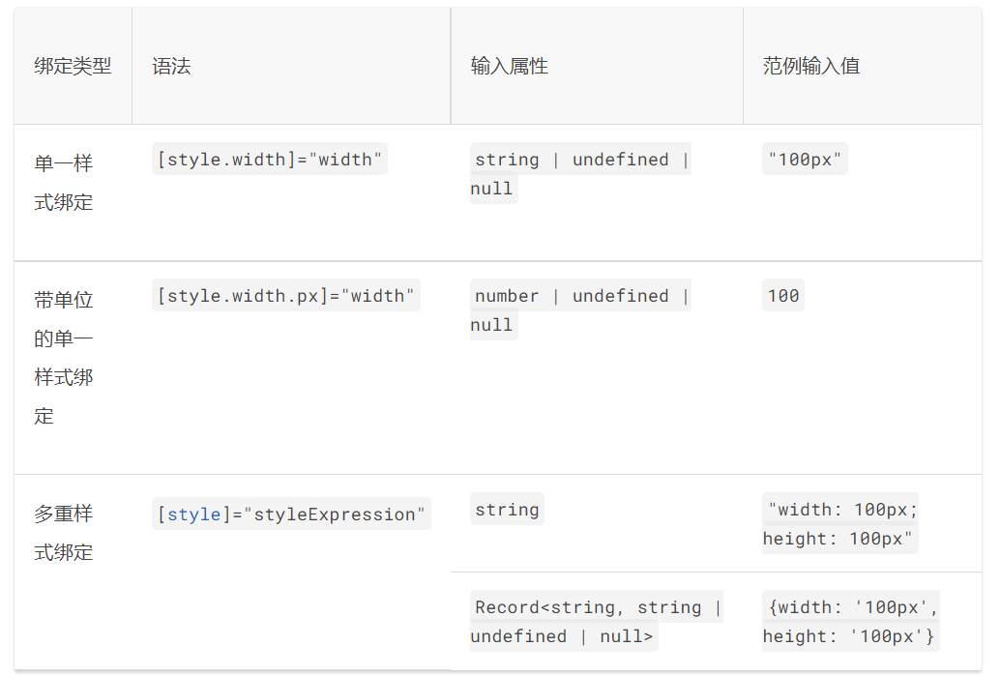

#### 绑定类 class

要创建单个类绑定，请使用前缀  `class`  后跟一个点和 CSS 类的名称，例如  `[class.sale]="onSale"`。`onSale`  为真值时添加类，在表达式为假值时（`undefined`  除外）删除类。

要绑定到多个类，请使用  `[class]`  来设置表达式 - 例如，`[class]="classExpression"`，此表达式可以取如下值：

- 用空格分隔的类名字符串

- 以类名作为键名并将真或假表达式作为值的对象。

- 类名的数组。

**对于任何类似对象的表达式（例如  `object`、`Array`、`Map`  或  `Set`，必须更改对象的引用，Angular 才能更新类列表。在不更改对象引用的情况下只更新其 Attribute 是不会生效的。**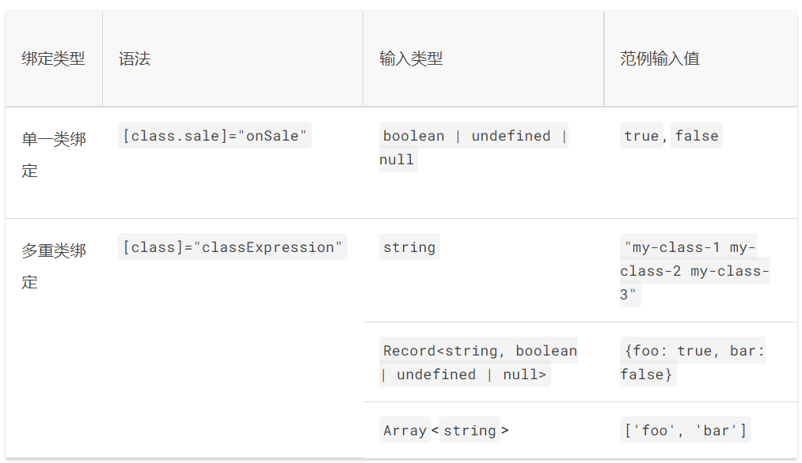

#### 双向绑定 ngModel

1. **导入  `[FormsModule]`，并将其添加到 NgModule 的  `imports`  列表中。**
2. 在 HTML 的  `<form>`  元素上添加  `[(ngModel)]`  绑定，并将其设置为等于此属性

```html
<label for="example-ngModel">[(ngModel)]:</label>
<input [(ngModel)]="currentItem.name" id="example-ngModel" />
```

可以自定义事件

```html
<input
  [ngModel]="currentItem.name"
  (ngModelChange)="setUppercaseName($event)"
/>
```

### 父子组件传值

父传子 prop 子传父 event props down event up

#### 父传子

输入型属性

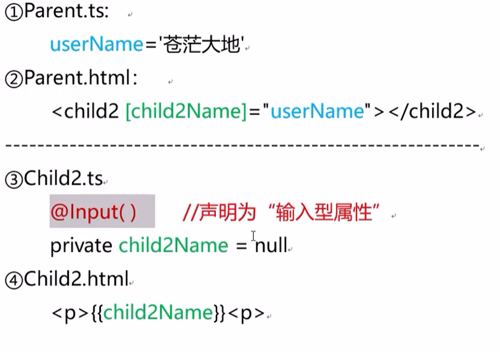

Input 在 angular core 里面

#### 子传父

$emit

子组件通过触发特定的事件(其中携帯着数据),把数据传递给父组件(父组件提供事件处理方法)

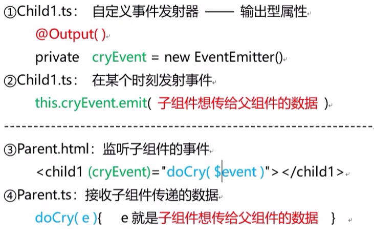

```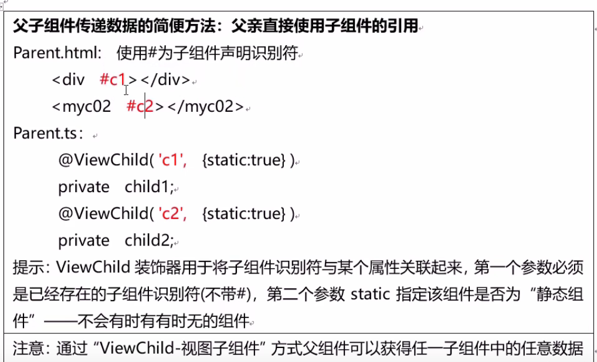
## 指令 directive

### 归纳

指令

1. 组件：组件继承自 Directive

2. 结构型指令：会改变 DOM 树结构，以\*开头，元素可能消失

3. 属性型指令：不会改变 DOM 树结构，只改变元素外观，用[]扩上

### 循环 ngFor

```html
<li *ngFor="let item of items; index as i; trackBy: trackByFn">...</li>
<ng-template
  ngFor
  let-item
  [ngForOf]="items"
  let-i="index"
  [ngForTrackBy]="trackByFn"
>
  <li>...</li>
</ng-template>
```

trackByFn 用来获取 index

### 条件 ngIf

```html
<div *ngIf="condition">Content to render when condition is true.</div>

<ng-template [ngIf]="condition">
  <div>Content to render when condition is true.</div>
</ng-template>

<div *ngIf="condition; else elseBlock">
  Content to render when condition is true.
</div>
<ng-template ##elseBlock>Content to render when condition is false.</ng-template>

<div id="test">
  <ng-template *ngIf="isValid(); then content; else other_content">
    here is ignored
  </ng-template>
</div>
<ng-template ##content>content here...</ng-template>
<ng-template ##other_content>other content here...</ng-template>
```

\*ngIF 可以跟函数 then else 只能是 template

### ngSwitch

```html
<container-element [ngSwitch]="switch_expression">
  <!-- the same view can be shown in more than one case -->
  <some-element *ngSwitchCase="match_expression_1">...</some-element>
  <some-element *ngSwitchCase="match_expression_2">...</some-element>
  <some-other-element *ngSwitchCase="match_expression_3">
    ...
  </some-other-element>
  <!--default case when there are no matches -->
  <some-element *ngSwitchDefault>...</some-element>
</container-element>
```

### 自定义指令

```shell
ng g directive directive-name
```

使用命令行生成会自动注册到模块

```typescript
import { Directive, ElementRef } from '@angular/core';

@Directive({
  selector: '[appMyStressDirective]',
})
export class MyStressDirectiveDirective {
  constructor(el: ElementRef) {
    console.log(el.nativeElement);
    el.nativeElement.style.backgroundColor = 'yellow';
  }
}
```

改变了一个元素的style，背景变为黄色。

## 管道 pipe

Filter：过滤器 → Pipe：管道

用于在View中呈现数据时显示为另一种格式，管道的本质是一个函数

管道接受原始数据 返回新的数据 相当于管道

### 自定义管道

```shell
ng g pipe pipe-name
```

命令行生成的会自动注册到module，手动生成的记得注册

```typescript
import { Pipe, PipeTransform } from '@angular/core';

@Pipe({
  name: 'myPipe'
})
export class MyPipePipe implements PipeTransform {
  // 固定的函数
  transform(value: unknown, ...args: unknown[]): unknown {
    let [isText, lang] = args;
    if (!isText) {
      return value ? '✅' : '❎';
    }
    if (lang === 'zh') {
      return value ? '已完成' : '未完成';
    } else {
      return value ? 'Completed' : 'Not completed';
    };
  }

}
```

value 是固定第一个值 

args 是其他参数

使用时 竖线前是value 竖线后是管道 分号分隔管道其他参数

```html
<span> {{ e.complete }} </span>
<span> {{ e.complete | myPipe : true : "zh" }} </span>
<p [title]="e.complete | myPipe">
```

### 预定义管道

**jsonPipe ：把对象转换为JSON字符串**

其他参考 [Angular - API 列表](https://angular.cn/api?type=pipe)

## 依赖注入 DI

**组件是与用户交互的对象，所有操作都应该与用户操作有关，与用户操作无关的应该放在服务里，剥离在外为组件服务**

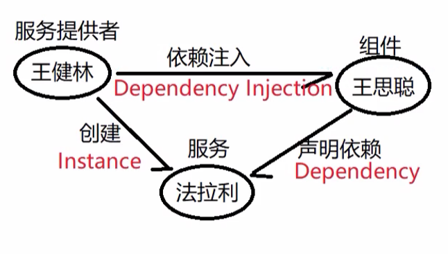

## 服务 service

组件不自己 new service 通过声明依赖来创建

```shell
ng g service service-name
```

生成模板

```typescript
// service.ts 声明服务的文件
import { Injectable } from '@angular/core';

@Injectable({
  providedIn: 'root' // 服务提供者
})
export class MyServiceService {

  constructor() { }

  // ...
}
```

component 使用 service

```ts
// component.ts
import { MyServiceService } from '../my-service.service';

@Component({
  selector: 'app-my-directive',
  templateUrl: './my-directive.component.html',
  styleUrls: ['./my-directive.component.scss'],
})
export class MyDirectiveComponent implements OnInit {
  serv: MyServiceService;
  constructor(serv: MyServiceService) {
    this.serv = serv;
  }
  someMethod(){
    serv.method();
  }
}
```

### HttpClient

```ts
// module.ts
import { HttpClientModule } from '@angular/common/http'

@NgModule({
  imports: [HttpClientModule],
})
export class LearningAngularModule {}
```

返回一个 rxjs 的 Observable 类型，使用 subscribe 获得返回信息

```ts
// service.ts
import { HttpClient } from '@angular/common/http';
import { Injectable } from '@angular/core';
import { Observable } from 'rxjs';
import { Currency } from './currency.model' // 数据定义接口

@Injectable({
  providedIn: 'root',
})
export class HttpNetworkService {
  httpClient: HttpClient;
  constructor(httpClient: HttpClient) {
    this.httpClient = httpClient;
  }

  getData(): Observable<Currency[]> {
    let url = 'https://api.blockchain.com/v3/exchange/tickers';
    return <Observable<Currency[]>> this.httpClient.get(url);
  }
}
```

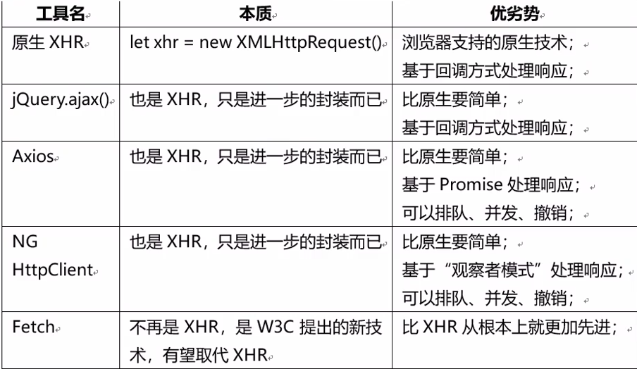

jquery 已经支持 promise 了，然而好像并没有什么卵用。

#### 发布订阅模式

Observable:可被关注的对象,在未来某个不确定的时间点可能抛出特定的事件

Subscribe:订阅,建立与可被关注的对象的契约,一旦得到新消息立即会被通知

## 模块 Module

### 备忘

想要其他模块使用组件需要export

## 路由

构建路由词典

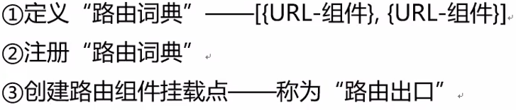

```shell
ng g module xx..module
```

### 子路由

使用 loadchild 懒加载

### 路由守卫

```
ng g guard xx
```


## TS相关

默认的访问控制是public

```ts
class Info {
    public name: string
    private age: number
    constructor() {
        // ...
    }
}

// ============>

class Info {
    constructor(
        public name: string
        private age: number ) {}
}
```
