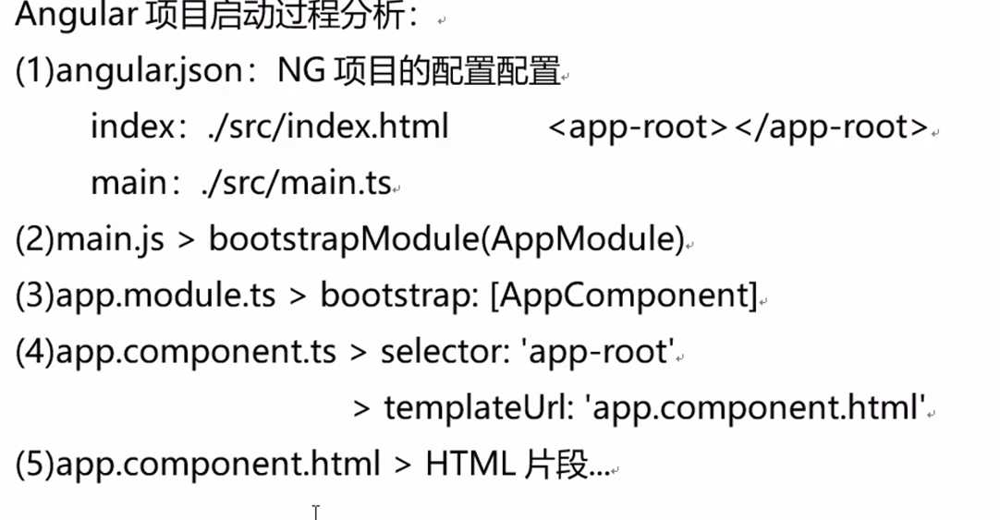

# Angular

## 基本概念

1. YAGNI You Arn't Gonna Need It.

2. dry Don't Repeat Yourself.

3. 对扩展开放，对修改封闭

4. 高内聚低耦合

5. 最少知识原则

## 基础概念

只能通过脚手架构建





模块是抽象透明的容器

主模块（APP）有且只有一个

## 备忘

- 路径既可以以根目录为根，也可以以当前位置为根或以模块为根

- 元素中的#表示编号，只有angular能使用，不是给html用 表示template reference

- ng-template 不会渲染到dom树 是透明的

- ng-template 与 ng-container 的区别：template里面得有结构化指令或者tenplate编号，没有不渲染，ng-cotainer 就是无辜的透明的

## 组件


### 创建

```shell
ng g component component-name
```

横线分割单词

在哪个module的文件夹下就创建在哪个module里，不在任何module下就在默认

### 基本状态

多文件组件：使用 templateUrl 和 styleUrls

```typescript
@Component({
  selector: 'app-my-com',
  templateUrl: './my-com.component.html',
  styleUrls: ['./my-com.component.scss']
}) 
export class MyComComponent implements OnInit {
  constructor() { }
  ngOnInit(): void {
  }
}
```

### 绑定

#### 归纳

Model->View 改变属性 []

View->Model 触发事件 ()

双向绑定 [()]

#### 绑定HTML

```html
{{NG表达式}}
```

NG表达式能各种运算

不能new 对象

不能用JSON对象

就是不能有副作用

#### 绑定数据

```html
<p attribute="{{value}}">text</p>
<p [attribute]="value">text</p>
```

里面也可以是NG表达式

#### 绑定事件

```html
<p (event name)="func()">text</p>
<p (event name)="func($event)">text</p>
```

函数一定要加括号

#### 绑定样式 style

```html
<nav [style.background-color]="expression"></nav>
<nav [style.backgroundColor]="expression"></nav>
```

可以用小驼峰，也可以连字符

ngStyle 不再提供显著价值，将来可能会被删除。(等于多重样式绑定的最后一种)

**当把 `[style]` 绑定到对象表达式时，该对象的引用必须改变，这样 Angular 才能更新这个类列表。在不改变对象引用的情况下更新其属性值是不会生效的。**


#### 绑定类 class

要创建单个类绑定，请使用前缀 `class` 后跟一个点和 CSS 类的名称，例如 `[class.sale]="onSale"`。`onSale` 为真值时添加类，在表达式为假值时（`undefined` 除外）删除类。

要绑定到多个类，请使用 `[class]` 来设置表达式 - 例如，`[class]="classExpression"`，此表达式可以取如下值：

- 用空格分隔的类名字符串

- 以类名作为键名并将真或假表达式作为值的对象。

- 类名的数组。

**对于任何类似对象的表达式（例如 `object`、`Array`、`Map` 或 `Set`，必须更改对象的引用，Angular 才能更新类列表。在不更改对象引用的情况下只更新其 Attribute 是不会生效的。**

#### 双向绑定

1. **导入 `[FormsModule]`，并将其添加到 NgModule 的 `imports` 列表中。**
2. 在 HTML 的 `<form>` 元素上添加 `[(ngModel)]` 绑定，并将其设置为等于此属性

```html
<label for="example-ngModel">[(ngModel)]:</label>
<input [(ngModel)]="currentItem.name" id="example-ngModel">
```

可以自定义事件

```html
<input [ngModel]="currentItem.name" (ngModelChange)="setUppercaseName($event)" >
```

## 指令

### 归纳

指令

1. 组件：组件继承自Directive

2. 结构型指令：会改变DOM树结构，以*开头，元素可能消失

3. 属性型指令：不会改变DOM树结构，只改变元素外观，用[]扩上

### 循环 ngFor

```html
<li *ngFor="let item of items; index as i; trackBy: trackByFn">...</li>
<ng-template ngFor let-item [ngForOf]="items" let-i="index" [ngForTrackBy]="trackByFn">
  <li>...</li>
</ng-template>
```

trackByFn 用来获取 index

### 条件 ngIf

```html
<div *ngIf="condition">Content to render when condition is true.</div>

<ng-template [ngIf]="condition"><div>Content to render when condition is
true.</div></ng-template>

<div *ngIf="condition; else elseBlock">Content to render when condition is true.</div>
<ng-template #elseBlock>Content to render when condition is false.</ng-template>

<div id="test">
  <ng-template *ngIf="isValid(); then content; else other_content"
    >here is ignored</ng-template>
</div>
<ng-template #content>content here...</ng-template>
<ng-template #other_content>other content here...</ng-template>
```

*ngIF 可以跟函数 then else 只能是 template

### ngSwitch

```html
<container-element [ngSwitch]="switch_expression">
  <!-- the same view can be shown in more than one case -->
  <some-element *ngSwitchCase="match_expression_1">...</some-element>
  <some-element *ngSwitchCase="match_expression_2">...</some-element>
  <some-other-element *ngSwitchCase="match_expression_3">...</some-other-element>
  <!--default case when there are no matches -->
  <some-element *ngSwitchDefault>...</some-element>
</container-element>
```

#### 自定义指令

```shell
ng g directive directive-name
```
