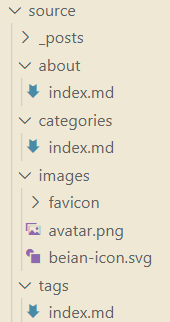
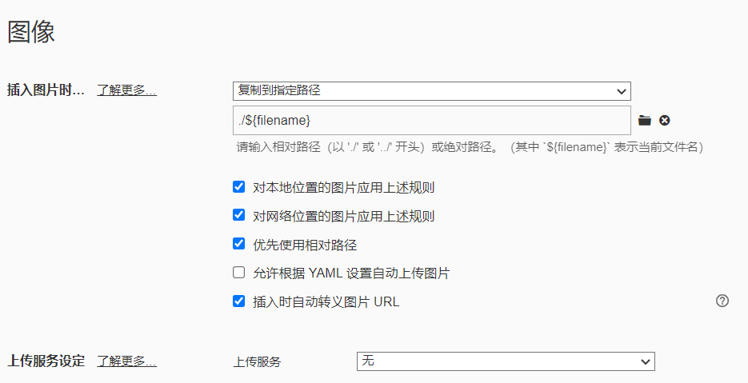

记一下避免:chipmunk:行为

<!--more-->

## 安装

全局装命令行，初始化

```shell
npm install -g hexo-cli
hexo init lisongyuan99.github.io
```

进入文件夹，安装插件

```shell
cd lisongyuan99.github.io
yarn add hexo-image-link hexo-theme-next hexo-filter-emoji hexo-deployer-git hexo-generator-searchdb
```

## 配置

### 配置文件

`_config.yml`

```yaml
# Site
title: 李西西的备忘录
subtitle: ""
description: ""
keywords:
author: 李西西
language: zh-CN
timezone: ""

# URL
## If your site is put in a subdirectory, set url as 'http://example.com/child' and root as '/child/'
url: https://lisongyuan99@github.io
root: /
# permalink: :year/:month/:day/:title/
permalink: posts/:title/
permalink_defaults:
pretty_urls:
  trailing_index: true # Set to false to remove trailing 'index.html' from permalinks
  trailing_html: true # Set to false to remove trailing '.html' from permalinks

# 注意这里
post_asset_folder: true

# Extensions
## Plugins: https://hexo.io/plugins/
## Themes: https://hexo.io/themes/
theme: next

# Deployment
## Docs: https://hexo.io/docs/one-command-deployment
deploy:
  - type: git
    repo: git@github.com:lisongyuan99/lisongyuan99.github.io.git
    branch: github-pages

# 内置搜索
search:
  path: search.xml
  field: post
  content: true
  format: html
```

`_config.next.yml`

```yaml
# scheme: Muse
# scheme: Mist
scheme: Pisces
# scheme: Gemini
language: zh-CN
footer:
  since: 2020
  powered: false
  icon:
    # name: fa fa-user
    animated: true
    # color: "#808080"
  # beian:
  #   enable: true
  #   icp: 黑ICP备 20000491号-1
  #   gongan_id: 23010302000977
  #   gongan_num: 黑公网安备 23010302000977号
  #   gongan_icon_url: http://static.lsy99.cn/公安.svg

# 何时显示菜单栏
sidebar:
  # display: post
  display: always

# 侧边菜单栏
menu:
  home: / || fa fa-home
  archives: /archives/ || fa fa-archive
  tags: /tags/ || fa fa-tags
  categories: /categories/ || fa fa-th
  about: /about/ || fa fa-user
  # sitemap: /sitemap.xml || fa fa-sitemap
  # schedule: /schedule/ || fa fa-calendar

# 标签云
tagcloud:
  min: 12 # Minimun font size in px
  max: 36 # Maxium font size in px
  # amount: 200 # Total amount of tags
  # orderby: name # Order of tags
  # order: 1 # Sort order

# 侧边栏头像
avatar:
  url: /images/avatar.png
  # 圆的
  # rounded: true
  # 旋转
  # rotated: true

# 侧边栏 社交
social:
  GitHub: https://github.com/lisongyuan99 || fab fa-github
  E-Mail: mailto:lsy114514@hotmail.com || fa fa-envelope
  # Weibo: https://weibo.com/yourname || fab fa-weibo
  # Google: https://plus.google.com/yourname || fab fa-google
  # Twitter: https://twitter.com/yourname || fab fa-twitter
  # FB Page: https://www.facebook.com/yourname || fab fa-facebook
  # StackOverflow: https://stackoverflow.com/yourname || fab fa-stack-overflow
  # YouTube: https://youtube.com/yourname || fab fa-youtube
  # Instagram: https://instagram.com/yourname || fab fa-instagram
  # Skype: skype:yourname?call|chat || fab fa-skype
social_icons:
  enable: true
  icons_only: false
  transition: true

# Github 章鱼猫
github_banner:
  enable: true
  permalink: https://github.com/lisongyuan99
  title: Follow me on GitHub

# 阅读进度条
reading_progress:
  enable: true
  # color: "#FC6423"
  color: "#222222"
  height: 2px

# 回到顶部
back2top:
  enable: true
  scrollpercent: true
  # sidebar: true

# tag从井号换图标
tag_icon: true

# 谷歌日历
# calendar:
#   calendar_id:
#   api_key:
#   orderBy: startTime
#   showLocation: false
#   offsetMax: 72
#   offsetMin: 4
#   showDeleted: false
#   singleEvents: true
#   maxResults: 250

toc:
  number: false

# Local search
# Dependencies: https://github.com/next-theme/hexo-generator-searchdb
local_search:
  enable: true
  # If auto, trigger search by changing input.
  # If manual, trigger search by pressing enter key or search button.
  trigger: auto
  # Show top n results per article, show all results by setting to -1
  top_n_per_article: 1
  # Unescape html strings to the readable one.
  unescape: false
  # Preload the search data when the page loads.
  preload: false

# 查看大图
fancybox: true
vendors:
  fancybox: //cdn.jsdelivr.net/gh/fancyapps/fancybox@3/dist/jquery.fancybox.min.js
  fancybox_css: //cdn.jsdelivr.net/gh/fancyapps/fancybox@3/dist/jquery.fancybox.min.css

favicon:
  small: /images/favicon/favicon-16x16.png
  medium: /images/favicon/favicon-32x32.png
  apple_touch_icon: /images/favicon/apple-touch-icon.png
  safari_pinned_tab: /images/favicon/safari-pinned-tab.svg
  android_manifest: /images/favicon/manifest.json
  ms_browserconfig: /images/favicon/browserconfig.xml
```

### 其他文件



`about.md`

```markdown
---
title: 关于
date: 2020-10-18 12:00:53
updated: 2020-10-18 12:00:53
tags:
---

:smile:
```

`categories.md`

```markd
---
title: 分类
date: 1999-02-04 12:58:00
type: categories
---
```

`tags.md`

```markdown
---
title: 标签
date: 1999-02-04 12:58:00
type: tags
---
```

### 配置 Typora

传图片复制一份到对应文件夹里



## 写东西

```shell
hexo new page hexo --path /front-end/hexo
```

指定文件位置方便管理

## 预览

```shell
hexo serve
```

## 部署

### GitHub Pages

新建个仓库叫 用户名.github.io

settings->pages->选分支

```shell
hexo deploy
```

### 服务器

等填坑
